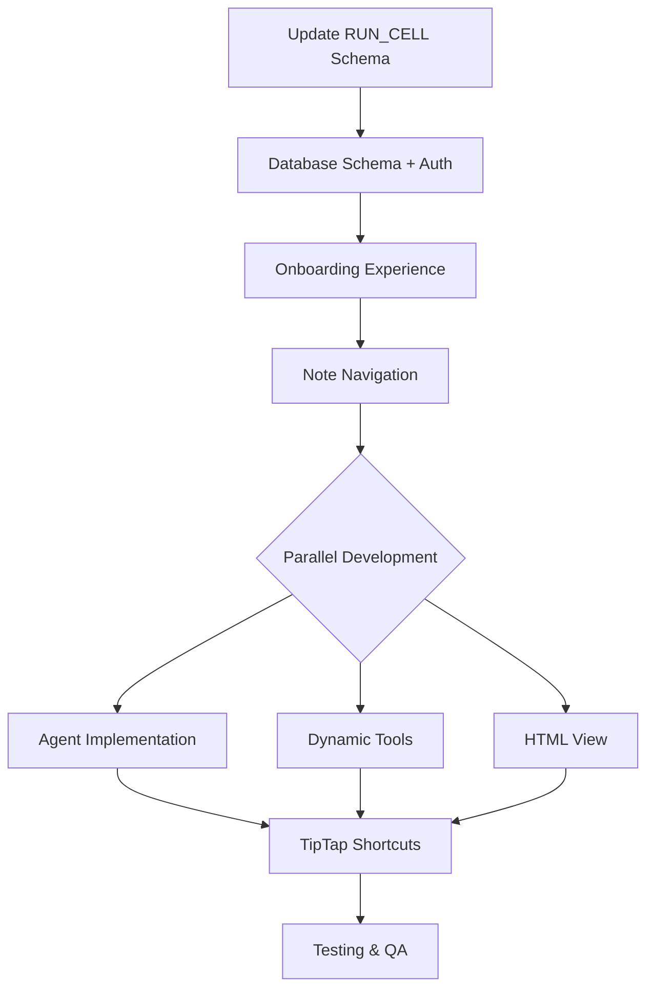

# 6) Implementation Timeline (Short Term)

## Suggested Sequence:

1. **Update `RUN_CELL` schema** (30min) — expand supported types to include html, python, json, excalidraw, workflow

2. **Installable App Foundation** (4h) — complete onboarding experience
   - Default onboarding notebook
   - Authentication modal and flow
   - Database schema and CRUD tools
   - Note navigation system

3. **HTML View with env** (2h) — rendering + `window.callTool()` + `/api/tool-call` route

4. **Dynamic Tool Calls** (4h) — discovery via JSON-RPC fetch + replace `availableTools.ts`

5. **Agent (AI SDK 5)** (6h) — `/stream` route + `useChat` + real-time tool calling

6. **TipTap Shortcuts** (4h) — "/" slash commands + "@" mentions + templates

**Total Estimate:** 2-3 business days, with focus on dynamic tool discovery.

---

## Dependencies:

### Sequential Dependencies:
1. **Installable App** must be completed first (foundation for everything else)
2. **Database Schema** must be in place before Agent implementation
3. **Authentication System** required for AI features
4. **Dynamic Tools** can be developed in parallel with Agent
5. **HTML View** can be developed independently
6. **Shortcuts** depend on TipTap editor being stable

### Parallel Development Opportunities:
- **HTML View** + **Dynamic Tools** can be developed simultaneously
- **Agent implementation** + **Shortcuts** can overlap once authentication is done
- **Database tools** + **Authentication modal** can be built in parallel

---

## Critical Path:

## Risk Mitigation:

### High Risk Items (Address First):
1. **Database migrations** - Test thoroughly in development
2. **Authentication state** - Implement proper error handling
3. **AI SDK 5 integration** - Have fallback for streaming failures

### Medium Risk Items:
1. **Dynamic tool discovery** - Cache results, handle offline integrations
2. **HTML sanitization** - Use DOMPurify strictly
3. **Keyboard shortcuts** - Test in different contexts

### Low Risk Items:
1. **UI components** - Use existing shadcn/ui patterns
2. **Note navigation** - Build on existing React Query patterns
3. **Template system** - Simple data structure and insertion
