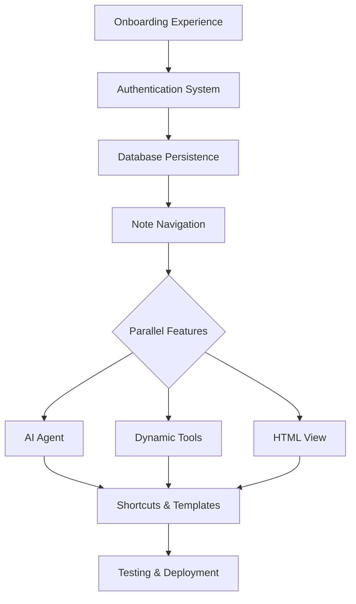

# Next Plan Index

This directory contains the complete implementation plan for making Deco Studio installable with advanced features.

## Plan Overview

The plan is organized into focused files for easier navigation and implementation:

## 📚 Plan Files

| File | Focus Area | Estimated Time |
|------|------------|----------------|
| **[01-installable-app.md](./01-installable-app.md)** | Complete onboarding experience, authentication, database persistence, note navigation | 4h |
| **[02-agent.md](./02-agent.md)** | AI agent with chat interface and real-time tool calling | 6h |
| **[03-dynamic-tools.md](./03-dynamic-tools.md)** | Dynamic tool discovery and execution system | 4h |
| **[04-html-view.md](./04-html-view.md)** | HTML view with environment access for interactive dashboards | 2h |
| **[05-shortcuts.md](./05-shortcuts.md)** | Slash commands, mentions, and template insertion | 4h |
| **[06-timeline.md](./06-timeline.md)** | Implementation sequence and dependencies | - |
| **[07-testing.md](./07-testing.md)** | Testing strategy and QA requirements | - |
| **[08-deployment.md](./08-deployment.md)** | Commands, dependencies, and deployment guide | - |
| **[09-definition-of-done.md](./09-definition-of-done.md)** | Completion criteria and success metrics | - |

## 🎯 Quick Start

1. **Start with Foundation**: Begin with [01-installable-app.md](./01-installable-app.md) as it provides the core onboarding experience and database foundation
2. **Check Timeline**: Review [06-timeline.md](./06-timeline.md) for implementation sequence and dependencies
3. **Setup Environment**: Follow [08-deployment.md](./08-deployment.md) for package installation and configuration
4. **Validate Progress**: Use [09-definition-of-done.md](./09-definition-of-done.md) to track completion

## 🏗️ Architecture Overview

## 📋 Key Features

### 🚀 **Installable App (Foundation)**
- Default onboarding notebook for logged-out users
- Authentication modal explaining deco app + $2 free credits
- Complete database persistence with SQLite + Drizzle
- Note navigation with search and daily note auto-creation
- Workspace display in topbar when logged in

### 🤖 **AI Agent Integration**
- Real-time chat interface with streaming responses
- Tool calling that modifies notebook cells automatically
- Context-aware suggestions based on current notebook
- AI SDK 5 implementation with Anthropic provider

### 🔧 **Dynamic Tool System**
- Automatic discovery of workspace integrations
- Direct JSON-RPC calls to MCP endpoints
- Dynamic tool execution without hardcoded lists
- Caching for performance optimization

### 🌐 **HTML View with Tools**
- Secure HTML rendering with DOMPurify
- `window.callTool()` access to workspace tools
- Interactive dashboard capabilities
- Iframe sandboxing for security

### ⚡ **Enhanced UX**
- Slash commands (/) for quick actions
- Variable mentions (@) with autocomplete
- Template insertion for common patterns
- Keyboard shortcuts (Cmd+N for new notes)

## 🎯 Success Criteria

- **User Onboarding**: Seamless experience from discovery to workspace connection
- **AI Integration**: Smooth chat experience with real-time notebook modifications
- **Tool Discovery**: Automatic access to all workspace integrations
- **Data Persistence**: Reliable notebook storage and retrieval
- **Performance**: Fast, responsive interface with proper caching

## 📈 Implementation Priority

1. **High Priority**: Installable app foundation (authentication, database, navigation)
2. **Medium Priority**: AI agent and dynamic tools (core functionality)
3. **Low Priority**: HTML view and shortcuts (enhancement features)

Each file contains complete implementation details, code examples, and acceptance criteria for successful delivery.
